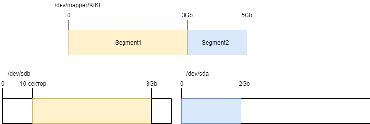
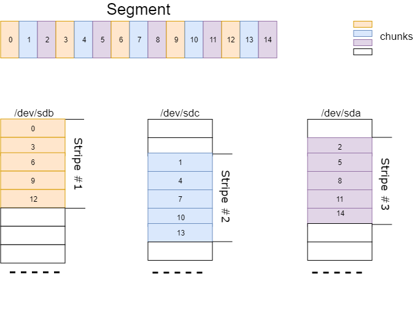
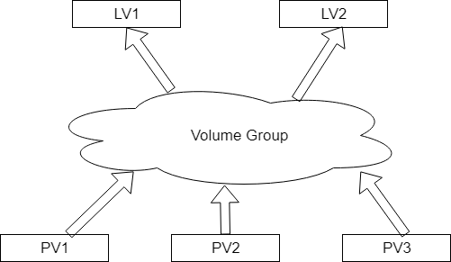
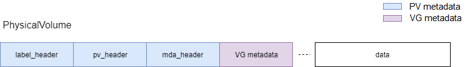
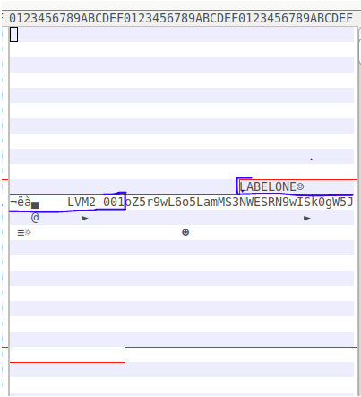
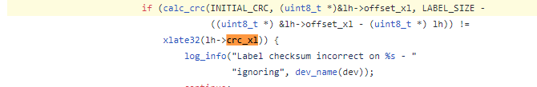
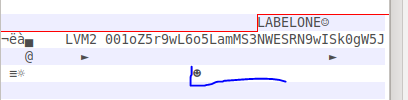
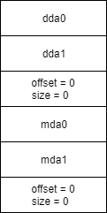
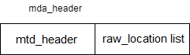
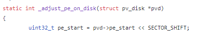

# LVM2 Backup Demo
This is a quite simple example of backuping/restoring a logic volume by code.
Also, here you can see an information about a physical_volume's structure.

All information is based on the LVM2 source code and [RedHat's documentation](https://access.redhat.com/documentation/en-us/red_hat_enterprise_linux/6/html/logical_volume_manager_administration/index)

### Explanation of this demo
##### device-mapper
Before the direct moving to the LVM2 one makes a sense to look at device-mapper.
Device-Mapper is a Linux kernel module that allows us to create a logical device that is based on the block one, generally speaking it maps the logic device to the block devices.

For example, you can create a logical device KIKI with size 5GB and the following mapping: 
- data from 0 to 3GB is linear mapped to the /dev/sdb with the offset of 10 sector.
- data from 3GB to 5GB linear mapped to the /dev/sdc from the 0 sector.

(take a look at the picture 1).

Every logical device consists of N segments. Every segment has it's own mapping type. When you create a logical device, you describe thease segments with a "mapping table".

Mapping types:
- linear
- striped
- mirror
- snapshot and snapshot-origin
- error
- zero
- multipath
- crypt
- RAID
- thin
- thin-pool

Let's take a look at linear and striped types.

**Linear:**
A linear mapping maps a continuous range of blocks onto another block devices.(Segment1, Segment2 in a picture1 has a linear mappings)

**Striped:**
Segment consist of an equally sized chunks.Next picture shows how chunks in the segments are mapped to the stripes.



**Communication with device-mapper**
In the code: with IOCTL.
In the script: with dmsetup(man 8 dmsetup).

Example of creating a LV with dmsetup:

```
dmsetup create device_name [-u uuid] [--notable|--table <table> 
```
<table> - "mapping table", every row describes a segment in LV
```
<table> =  “ start length mapping [mapping_parameters...] \n 
             start length mapping [mapping_parameters...] \n 
             … 
           “ 
```
Here "start length mapping [mapping_parameters...]" - Segment's description.

start - Segment's start. N+1 segment's start has to be N_start + N_length. 0 segment's start has to be 0
length - Segment's length. 
**Start and Length are calculated in SECTOR_SIZE.**
**So, start_in_bytes = start * SECTOR_SIZE**
Mapping - mapping type.
[mapping_parameters...] - mapping's params.

Example for liner and striped mappings:
**linear:**
```
start length linear device offset 
```
Device - Dvice name. (e.g: /dev/sdb or major:minor).
offset - Offset from the device's start.

Example:
```
0 10 linear /dev/sdb 0 
0 10 linear 8:2 0 
```

**Striped:**
```
start length striped #stripes chunk_size device1 offset1 ... deviceN offsetN
```
#stripes - stripes number.
chunk_size - chunk's size (in sectors).
device1 offset 1 … deviceN offset N  - description of stripes. 

Let's create a logical device from the picture1:

```
dmsetup create KIKI --table “ 0 6291456 linear /dev/sdb 10 \n 
                             6291456 4194304 linear /dev/sda 0 “ 
```

Let's create a logical device from the picture2.
```
dmsetup create KIKI –table “0 140 striped 3 10 /dev/sdb 0 /dev/sdc 20 /dev/sda 10” 
```
You can find a more detailed description about mapping types and their formats in the mapping table here:
https://www.kernel.org/doc/Documentation/device-mapper/

#### LVM2
LVM2 is based on the device-mapper.
Generelly speaking, LVM combines a block devices in one pool. From this pool it creates a logical devices.

LVM2 has a daemon that caches all VG information. After a manual manipulation with VG data one has to drop daemon's cache. For example, with "-cache" attribute in utilites like pvscan:  
sudo pvscan -cache

In LVM2 terms:
- Block devices that are combined in a pool - **Physical Volumes**, PV.
- Pool - **Volume Group**.
- Logical Device - **Logical Volume**, LV



So, in fact, logical volumes are mapped to physical_volumes device-mapper.

For example, let's createa a PV,LV 
```
sudo pvcreate /dev/sdb /dev/sda
sudo vgcreate LVMVolGroup /dev/sdb /dev/sda
sudo lvcreate -L 5G -n KIKI LVMVolGroup
```

Logical Volume types:
General:
- Linear 
- Striped 
- Mirrored 

Additional:
- RAID (RAID4/5/6) (since Red Hat Enterprise Linux 6.3) 
- THINLY-PROVISIONED (since Red Hat Enterprise Linux 6.4) 
- SNAPSHOT VOLUMES 
- THINLY-PROVISIONED SNAPSHOT 
- CACHE(since Red Hat Enterprise Linux 6.7) 

All information about the Volume Group structure is contained in the PV.
For example, after a reboot ,LVM2 will read every block device to find a physical_volumes, collect whole information and calculate everything for the device-mapper to create a logical Volumes.

Physical Volume structure:
*Order: Little-Endian.*



Let's make a term: Physical Volume's metadatas.
PV metadata consists of: label_header, pv_header, mda_header.

**1. label_header**

``` cpp
struct label_header 
{ 
    uint64_t magic; 
    uint64_t sector_number; 
    uint32_t checksum; 
    uint32_t offset;  
    uint64_t type; 
} __attribute__((packed)); 
```
- label_header, or just "label", identifies a block device as physical_volume.
It might be placed in one of the first 4 sectors.
- magic - equals to “LABELONE”. 
- sector_number - sector's number, where the labels is placed.
- checksum - label's checksum
- offset - offset from the sector's start to pv_header. pv_header_offset = SECTOR_SIZE * sector_number + offset;
- type - equals to “LVM2 001”



Some information about checksum:
checksum is calculated on the following datas: from the start of **offset** attribute to the **end of the sector**.
More detailed in the LVM2 source: /lib/label/label.c :139 -> calc_crc



**2. pv_header**
```cpp
struct pv_header 
{ 
     char                ID[32]; 
     uint64_t            volume_size; 
     DataAreaDescriptor* dda_list; 
     DataAreaDescriptor* mda_list; 
     char                rest[128]; 
 }; 
 ```
- ID - id :)
- volume_size - size of the current physical_volume.
- dda_list - will be described below.
- mda_list - will be described below.
- rest - something strange, little addition to the struct that covers some data that are generated with unknown to me way.I could not find in LVM2 source what generates them. It might be just a trash, but scince this data takes a part in pv_label's checksum calculation(because it is placed in the same sector), i've decided to catch them too.


```cpp
struct data_descriptor 
{ 
    uint64_t offset; 
    uint64_t size; 
}__attribute__((packed)); 
 ```
 - DDA: describes a data(LV's data) begin in the PV. Every list ends with empty data_descriptor struct.(16 bytes with zero value)
- Volume Group metadata - is a circular buffer where every element is a ascii text ended with \0. In every PV can be 0 to 4 copies of the VG metadatas.
- MDA(Metadata area): As I can see, every mda describes a mda_header location. Just like the dda list, mda list ends with empty data_descriptor struct (16 bytes with zero)



**3.mda_header**


```cpp
struct mtd_header 
{ 
    uint32_t checksum; 
    char     magic[32]; 
    uint32_t version; 
}__attribute__((packed)); 

struct raw_location 
{ 
    uint64_t offset = 0; 
    uint64_t size = 0; 
    uint32_t checksum = 0; 
    uint32_t flags = 0; 
}__attribute__((packed)); 
```
mda_header consist of two objects: mtd_header and raw_location list(ends with empty struct)
mtd_header:
- checksum - I guess, it's a metadata checksum, maybe it's calculated just like pv_label's one.
- magic - equals to " LVM2 x[5A%r0N*>" 
- version - :)
 
raw_location: As I can see, it's a description of the last element in VG metadata circular buffer.

**4. Some information about a data:**
Looks like in the last version of the LVM2 data is aligned to 1Mb
https://www.redhat.com/archives/lvm-devel/2010-August/msg00099.html 

 

##### Volume Group Metadata
**Extent's size in bytes = extent_count * SECTOR_SIZE**
**but, pe_start in bytes = pe_start * SECTOR_SIZE**
**so, pe_start calculates not in extents!**
You can insure that with 2 ways:
1. LVM2 source /Lib/format1/layout.c : 49


2.  pe_start * SECTOR_SIZE = dda's offset = 1Mb(in my case)

Ways to look at VG metadata:
1. man vgcfgbackup 
2. read a label_header, read a pv_header, read a mda_header, from the raw_location take an offset of metadata.
 
Suppose, we have a VG papk with the only LV(linear mapping) TEST_ONE_VG and two PV pv0,pv1
```
# Generated by LVM2 version 2.02.176(2) (2017-11-03): Thu Jun  6 20:17:26 2019 
contents = "Text Format Volume Group" 
version = 1 
description = "vgcfgbackup papk -f ./papk_meta" 
creation_host = "rew-VirtualBox"    # Linux rew-VirtualBox 4.18.0-20-generic #21~18.04.1-Ubuntu SMP Wed May 8 08:43:37 UTC 2019 x86_64 
creation_time = 1559841446    # Thu Jun  6 20:17:26 2019 

papk { 
    id = "O2H1Ho-GaUh-v831-2uQL-hD21-oHa6-2hQgBP" 
    seqno = 3 
    format = "lvm2"            # informational 
    status = ["RESIZEABLE", "READ", "WRITE"] 
    flags = [] 
    extent_size = 8192        # 4 Megabytes 
    max_lv = 0 
    max_pv = 0 
    metadata_copies = 0 
    
    physical_volumes { 
        pv0 { 
            id = "PvxCd9-Bdo0-u64M-UadT-ESAG-KJVD-BLf2Vk" 
            device = "/dev/sdb"    # Hint only 
            status = ["ALLOCATABLE"] 
            flags = [] 
            dev_size = 2097152    # 1024 Megabytes 
            pe_start = 2048 
            pe_count = 255    # 1020 Megabytes 
        } 
        
        pv1 { 
            id = "Swlbem-LE9Y-Mq8p-VOqj-NUOp-tZZX-7Iy5si" 
            device = "/dev/sdc"    # Hint only 
            status = ["ALLOCATABLE"] 
            flags = [] 
            dev_size = 2097152    # 1024 Megabytes 
            pe_start = 2048 
            pe_count = 255    # 1020 Megabytes 
        } 
    } 

    logical_volumes { 
        TEST_ONE_VG { 
            id = "J21cMO-6kK7-R28x-IX1P-2jJI-Hyzy-mVOGR7" 
            status = ["READ", "WRITE", "VISIBLE"] 
            flags = [] 
            creation_time = 1555238584    # 2019-04-14 13:43:04 +0300 
            creation_host = "rew-VirtualBox" 
            segment_count = 2 

            segment1 { 
                start_extent = 0 
                extent_count = 255    # 1020 Megabytes 
                type = "striped" 
                stripe_count = 1    # linear 

                stripes = [ 
                    "pv0", 0 
                ] 
            } 

            segment2 { 
                start_extent = 255 
                extent_count = 78    # 312 Megabytes 
                type = "striped" 
                stripe_count = 1    # linear 
                stripes = [ 
                    "pv1", 0 
                ] 
            } 
        }  
} 
```
 
 It could be parsed directly, but i've decided to write a clumsy grammar
```
LVM_METADATA 
    : PARAMETERS VOLUME_GROUP                                 
    | VOLUME_GROUP PARAMETERS                                 

VOLUME_GROUP 
    : TOKEN_NAME "{" PARAMETERS VOLUME_GROUP_SECTIONS "}"      

VOLUME_GROUP_SECTIONS 
    : PHYSICAL_VOLUME_SECTION LOGICAL_VOLUME_SECTION           
    | LOGICAL_VOLUME_SECTION PHYSICAL_VOLUME_SECTION           
    | PHYSICAL_VOLUME_SECTION                                  

PHYSICAL_VOLUME_SECTION 
    : "physical_volumes" "{" SUB_SECTIONS_LIST "}"             

LOGICAL_VOLUME_SECTION 
    :  "logical_volumes"  "{" LOGICAL_VOLUMES_LIST "}"         

LOGICAL_VOLUMES_LIST 
    : LOGICAL_VOLUME LOGICAL_VOLUMES_LIST                      
    | LOGICAL_VOLUME                                           

LOGICAL_VOLUME 
    : TOKEN_NAME "{" PARAMETERS SUB_SECTIONS_LIST "}"          

SUB_SECTIONS_LIST 
    : SUB_SECTIONS_LIST SUB_SECTION                            
    | SUB_SECTION                                              

SUB_SECTION 
    : TOKEN_NAME "{" PARAMETERS "}"                            

PARAMETERS 
    : PARAMETERS PARAMETER                                     
    | PARAMETER                                                

PARAMETER 
    : TOKEN_NAME "=" VALUE                                     

VALUE 
    : TOKEN_STRING_VALUE                                       
    | ARRAY                                                    

ARRAY 
    : "[" STRING_LIST "]"                                      
    | "[" "]"                                                  

STRING_LIST 
    : TOKEN_STRING_VALUE "," STRING_LIST                       
    | TOKEN_STRING_VALUE                                       
```

As I've understood, every segment in LV fully describes a row in the "mapping table" in device_mapper.
Example:
```
segment1 { 
                start_extent = 0 
                extent_count = 255    # 1020 Megabytes 
                type = "striped" 
                stripe_count = 1    # linear 

                stripes = [ 
                    "pv0", 0 
                ] 
            } 
            segment2 { 
                start_extent = 255 
                extent_count = 78    # 312 Megabytes 
                type = "striped" 
                stripe_count = 1    # linear 
                stripes = [ 
                    "pv1", 0 
                ] 
            } 
```

```
255*8192 = 2088960 
78 * 8192 = 638976 
“0 2088960 linear /dev/sdb 0 \n 2088960 638976 linear /dev/sdc 0 “ 
```

#### Simple LV backup/restore.

Backup:
1. Collect all VG metadata in the system(read all block devices)
2. Find a VG that contains the LV.
3. Get a Segments.
4. Read a metadata of physical_volumes that are mentioned in segments.(Data from the start of block device to the end of the last element in VG metadata cirtular buffer)
5. Get from the VG metadata mappings physical_volume : {device, pe_start}
6. Write to the backup archive metadata of physical_volumes.
7. Write to the archive segment's info.
8. Write to the archive a whole LV.

Restore:
1. Restore from the archive all PV metadatas.
2. Restore every segment from the archive to PVs.

